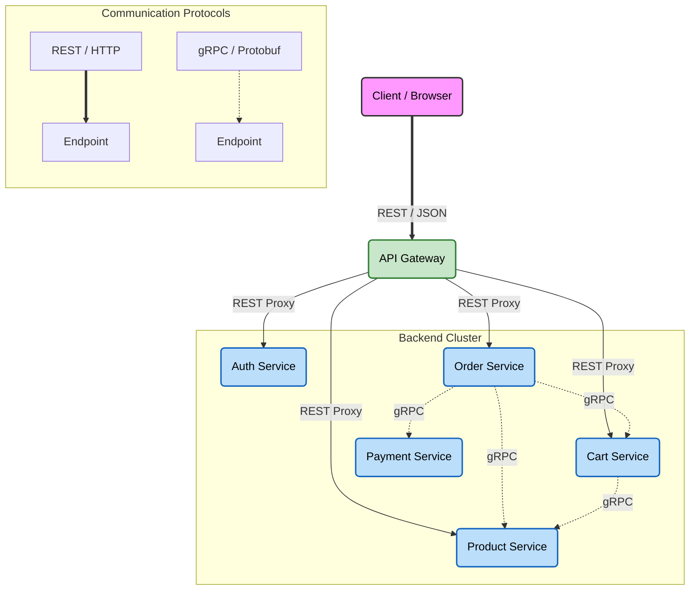
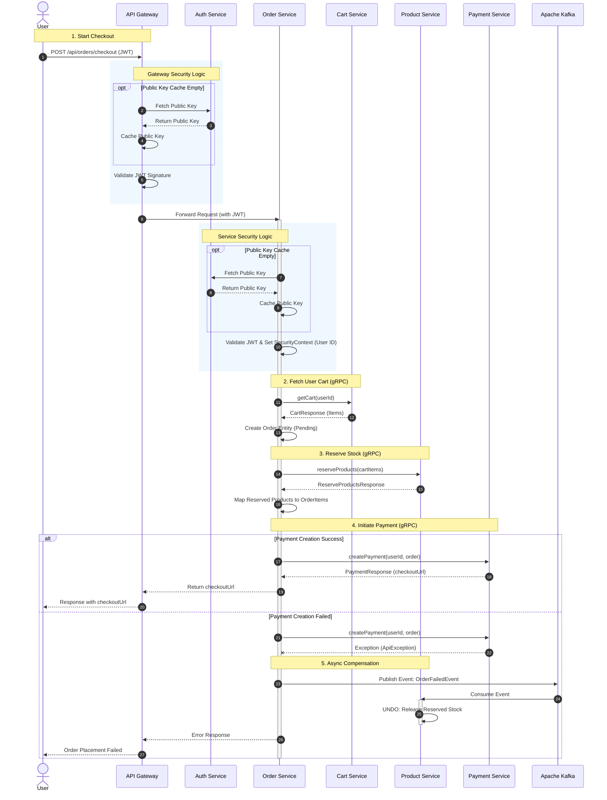

### E-commerce Platform Backend — Microservices Architecture
A modular **Spring Boot** system designed for seamless online retail operations. This project implements a scalable microservices architecture with a **Hybrid Communication Strategy**: **REST** for external client interactions, **gRPC** for high-performance inter-service communication, and **Apache Kafka** for asynchronous, event-driven consistency.
## Tech Stack
* Java 21, Spring(Boot, Data JPA, Security, Cloud)
* REST, gRPC, Apache Kafka
* PostgreSQL, Hibernate, Liquibase
* AWS (S3)
* Stripe
* JUnit, Mockito
* Gradle, Docker


## Services Overview

### **Auth Service**
* Supports local authentication (email/password)
* OAuth2 login via Google
* JWT issuing (RSA-based signing) with Public/Private key management

### **Cart Service**
* Shopping cart management

### **Order Service**
* Order processing
* Manages the complete order lifecycle (Created -> Paid -> Shipped)

### **Payment Service**
* Secure payment processing via Stripe integration
* Handles webhooks for payment status updates (Success/Cancel)
* 
### **Product Service**
* Comprehensive handling of Products, Brands, and Categories
* Stock reservation mechanism to prevent overselling
* Product interactions (Likes) support

### **API Gateway**
* Single entry point for all client requests
* Routes requests to appropriate microservices.
* Centralized security management

## 🛡️ Security Architecture

We utilize a **Zero Trust** approach, handling security at two distinct levels to ensure maximum protection.

### 1. API Gateway (Authentication)
The Gateway acts as the perimeter guard. It answers the question: **"Who are you?"**
* **Validation:** It verifies the JWT signature (RSA) and checks the token's expiration for every incoming request.
* **Filtering:** Unauthenticated or malformed requests are rejected immediately at the edge, protecting internal services from unnecessary load.

### 2. Microservices (Authorization)
Each microservice (Product, Order, Payment) operates independently. It answers the question: **"What can you do?"**
* **Verification:** Services re-validate the token to ensure integrity.
* **Logic:** Specific business rules and permissions (RBAC) are enforced here. For example, ensuring only an `ADMIN` can delete products or that users can only view their own order history.

**Key Benefit:** Even if the network perimeter is breached, individual services remain secure because they do not blindly trust internal traffic.

## Communication Architecture
The platform employs a hybrid communication strategy to balance standard compliance with high performance.

* **External Layer (REST):** The **API Gateway** serves as the single entry point for external clients (Web/Mobile), using standard **REST/JSON** for broad compatibility and ease of integration.
* **Internal Layer (gRPC):** Once inside the secure cluster, microservices communicate synchronously using **gRPC** (Protobuf). This ensures low latency, strict type safety, and high efficiency for critical inter-service operations (e.g., Order processing).



## Order Processing Workflow



## Project Setup

### Prerequisites
* Docker installed.
* Java 21 (for local development).

### 1. Run with Docker (Recommended)

1. Clone this repository to your local machine:
```bash
git clone [github_repo_link]
```

2. Set up .env variables in the root folder:
```
#▞▞▞▞▞▞▞▞▞▞▞▞▞▞▞▞▞▞▞▞▞▞▞▞▞▞ product-service ▞▞▞▞▞▞▞▞▞▞▞▞▞▞▞▞▞▞▞▞▞▞▞▞▞▞▞▞▞▞▞#
AWS_ACCESS_KEY
AWS_SECRET_ACCESS_KEY
AWS_REGION
PRODUCTS_BUCKET_NAME

#▞▞▞▞▞▞▞▞▞▞▞▞▞▞▞▞▞▞▞▞▞▞▞▞▞▞ payment-service ▞▞▞▞▞▞▞▞▞▞▞▞▞▞▞▞▞▞▞▞▞▞▞▞▞▞▞▞▞▞▞#
STRIPE_SECRET_KEY
STRIPE_WEBHOOK_SECRET
STRIPE_CANCEL_URL
STRIPE_SUCCESS_URL

#▞▞▞▞▞▞▞▞▞▞▞▞▞▞▞▞▞▞▞▞▞▞▞▞▞▞ auth-service ▞▞▞▞▞▞▞▞▞▞▞▞▞▞▞▞▞▞▞▞▞▞▞▞▞▞▞▞▞▞▞#
PUBLIC_KEY_EXPIRATION
REFRESH_TOKEN_SECRET
REFRESH_TOKEN_TTL
JWT_EXPIRE_TIME
JWT_ISSUER
GOOGLE_CLIENT_ID
GOOGLE_CLIENT_SECRET
EMAIL_SENDER_PASSWORD
EMAIL_SENDER_USERNAME
```

3. Run command from root folder:
```bash
docker-compose -f docker-compose.yml up --build
```

4. Once the command completes, the application will be accessible on http://localhost:3030


### 2. Local Development

1. Clone this repository to your local machine:
```bash
git clone [github_repo_link]
```

2. Set up .env variables in the root folder:

```
#▞▞▞▞▞▞▞▞▞▞▞▞▞▞▞▞▞▞▞▞▞▞▞▞▞▞ product-service ▞▞▞▞▞▞▞▞▞▞▞▞▞▞▞▞▞▞▞▞▞▞▞▞▞▞▞▞▞▞▞#
PRODUCT_SERVICE_PROFILE=dev
PRODUCT_DB_URL
PRODUCT_SERVICE_PORT
PRODUCT_GRPC_CHANNEL
PRODUCT_GRPC_PORT
AWS_ACCESS_KEY
AWS_SECRET_ACCESS_KEY
AWS_REGION
PRODUCTS_BUCKET_NAME

#▞▞▞▞▞▞▞▞▞▞▞▞▞▞▞▞▞▞▞▞▞▞▞▞▞▞ cart-service ▞▞▞▞▞▞▞▞▞▞▞▞▞▞▞▞▞▞▞▞▞▞▞▞▞▞▞▞▞▞▞#
CART_SERVICE_PROFILE=dev
CART_GRPC_CHANNEL
CART_DB_URL
CART_SERVICE_PORT
CART_GRPC_PORT

#▞▞▞▞▞▞▞▞▞▞▞▞▞▞▞▞▞▞▞▞▞▞▞▞▞▞ order-service ▞▞▞▞▞▞▞▞▞▞▞▞▞▞▞▞▞▞▞▞▞▞▞▞▞▞▞▞▞▞▞#
ORDER_SERVICE_PROFILE=dev
ORDER_SERVICE_PORT
ORDER_DB_URL

#▞▞▞▞▞▞▞▞▞▞▞▞▞▞▞▞▞▞▞▞▞▞▞▞▞▞ payment-service ▞▞▞▞▞▞▞▞▞▞▞▞▞▞▞▞▞▞▞▞▞▞▞▞▞▞▞▞▞▞▞#
PAYMENT_GRPC_CHANNEL
PAYMENT_SERVICE_PORT
PAYMENT_SERVICE_PROFILE=dev
STRIPE_SECRET_KEY
STRIPE_WEBHOOK_SECRET
STRIPE_CANCEL_URL
STRIPE_SUCCESS_URL
PAYMENT_DB_URL
PAYMENT_GRPC_PORT

#▞▞▞▞▞▞▞▞▞▞▞▞▞▞▞▞▞▞▞▞▞▞▞▞▞▞ auth-service ▞▞▞▞▞▞▞▞▞▞▞▞▞▞▞▞▞▞▞▞▞▞▞▞▞▞▞▞▞▞▞#
AUTH_SERVICE_PROFILE=dev
AUTH_SERVICE_PORT
AUTH_DB_URL
PUBLIC_KEY_EXPIRATION
REFRESH_TOKEN_SECRET
REFRESH_TOKEN_TTL
JWT_EXPIRE_TIME
JWT_ISSUER
GOOGLE_CLIENT_ID
GOOGLE_CLIENT_SECRET
EMAIL_SENDER_PASSWORD
EMAIL_SENDER_USERNAME

#▞▞▞▞▞▞▞▞▞▞▞▞▞▞▞▞▞▞▞▞▞▞▞▞▞▞ api-gateway ▞▞▞▞▞▞▞▞▞▞▞▞▞▞▞▞▞▞▞▞▞▞▞▞▞▞▞▞▞▞▞#
API_GATEWAY_PROFILE=dev
API_GATEWAY_PORT
AUTH_SERVICE_URL
CART_SERVICE_URL
PAYMENT_SERVICE_URL
PRODUCT_SERVICE_URL
ORDER_SERVICE_URL
API_GATEWAY_URL

KAFKA_URL

DB_USER
DB_PASSWORD
```

3. Run the following command to start services (Postgres, Kafka, and so on) in Docker:
```bash
docker-compose -f docker-compose-infrastructure.yml up --build
```


